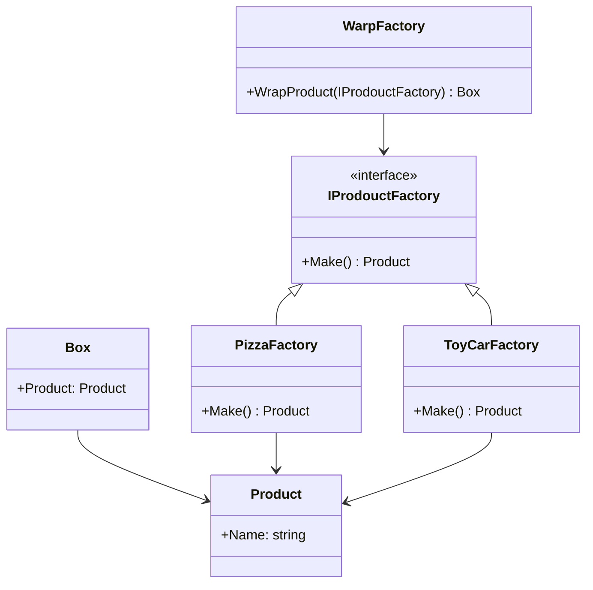
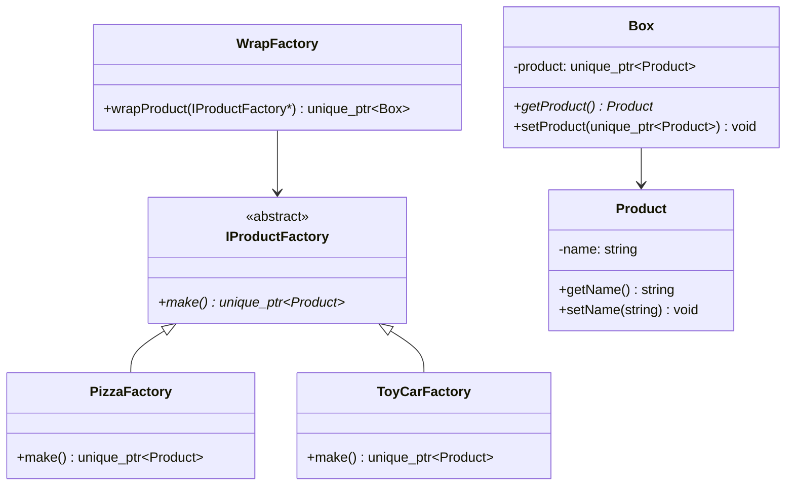

# C#接口实现到C++转换设计

## 概述

本文档分析了C#的接口实现机制，并设计了在C++中实现相同功能的方法。通过对比C#的`interface`关键字与C++的抽象基类和虚函数，展示了如何在C++中实现多态和工厂模式。

## C#代码分析

### 核心组件



### 设计模式识别

1. **工厂模式**: `PizzaFactory`和`ToyCarFactory`实现了产品创建
2. **抽象工厂模式**: `WarpFactory`接受不同的工厂实现
3. **多态性**: 通过接口`IProdouctFactory`实现运行时绑定

## C++实现设计

### 架构对比

| C#特性 | C++等价实现 |
|--------|-------------|
| `interface` | 纯虚函数抽象基类 |
| 自动属性 | 成员变量 + getter/setter |
| `new` 关键字 | `std::make_unique` 或直接构造 |
| 垃圾回收 | 智能指针(`std::unique_ptr`) |

### 类层次结构



### 内存管理策略

1. **智能指针使用**
   - `std::unique_ptr<Product>`: 独占所有权的产品对象
   - `std::unique_ptr<Box>`: 独占所有权的包装盒对象
   - 原始指针: 工厂对象的传递(不转移所有权)

2. **RAII原则**
   - 构造函数中初始化资源
   - 析构函数自动清理(由智能指针管理)
   - 移动语义避免不必要的拷贝

### 核心实现细节

#### 接口定义
```cpp
// 抽象基类替代C#接口
class IProductFactory {
public:
    virtual ~IProductFactory() = default;  // 虚析构函数
    virtual std::unique_ptr<Product> make() = 0;  // 纯虚函数
};
```

#### 多态实现
```cpp
// 运行时多态通过虚函数表实现
std::unique_ptr<Box> box1 = wrapFactory.wrapProduct(&pizzaFactory);
std::unique_ptr<Box> box2 = wrapFactory.wrapProduct(&toyCarFactory);
```

#### 资源管理
```cpp
// 使用移动语义优化性能
std::unique_ptr<Product> product = productFactory->make();
box->setProduct(std::move(product));
```

## 技术对比分析

### 语言特性对比

| 特性 | C# | C++ |
|------|----|----|
| 接口定义 | `interface` 关键字 | 抽象基类 + 纯虚函数 |
| 多态实现 | 自动虚函数调度 | 显式虚函数表 |
| 内存管理 | 垃圾回收 | 手动管理/智能指针 |
| 类型安全 | 编译时 + 运行时 | 主要编译时 |
| 性能开销 | GC暂停 | 确定性析构 |

### 实现复杂度

1. **C#优势**
   - 语法简洁，接口定义清晰
   - 自动内存管理
   - 属性语法糖

2. **C++优势**
   - 零开销抽象
   - 确定性资源管理
   - 更细粒度的控制

### 最佳实践建议

1. **C++接口设计**
   - 总是提供虚析构函数
   - 使用纯虚函数定义接口契约
   - 考虑使用`= default`和`= delete`

2. **内存管理**
   - 优先使用智能指针
   - 明确所有权语义
   - 避免裸指针的所有权传递

3. **性能优化**
   - 使用移动语义减少拷贝
   - 考虑模板特化避免虚函数开销
   - 合理使用内联函数

## 单元测试策略

### 测试用例设计

1. **工厂创建测试**
   - 验证不同工厂创建的产品类型
   - 测试产品名称设置正确性

2. **多态行为测试**
   - 通过基类指针调用虚函数
   - 验证运行时类型识别

3. **内存管理测试**
   - 验证智能指针的正确释放
   - 测试移动语义的性能

4. **边界条件测试**
   - 空指针处理
   - 异常安全性验证

### 测试框架选择

- **Google Test**: 功能完整的C++测试框架
- **Catch2**: 轻量级，头文件库
- **doctest**: 最快的编译速度
## C++实现设计

### 架构对比

| C#特性 | C++等价实现 |
|--------|-------------|
| `interface` | 纯虚函数抽象基类 |
| 自动属性 | 成员变量 + getter/setter |
| `new` 关键字 | `std::make_unique` 或直接构造 |
| 垃圾回收 | 智能指针(`std::unique_ptr`) |

### 类层次结构


### 内存管理策略

1. **智能指针使用**
   - `std::unique_ptr<Product>`: 独占所有权的产品对象
   - `std::unique_ptr<Box>`: 独占所有权的包装盒对象
   - 原始指针: 工厂对象的传递(不转移所有权)

2. **RAII原则**
   - 构造函数中初始化资源
   - 析构函数自动清理(由智能指针管理)
   - 移动语义避免不必要的拷贝

### 核心实现细节

#### 接口定义
```cpp
// 抽象基类替代C#接口
class IProductFactory {
public:
    virtual ~IProductFactory() = default;  // 虚析构函数
    virtual std::unique_ptr<Product> make() = 0;  // 纯虚函数
};
```

#### 多态实现
```cpp
// 运行时多态通过虚函数表实现
std::unique_ptr<Box> box1 = wrapFactory.wrapProduct(&pizzaFactory);
std::unique_ptr<Box> box2 = wrapFactory.wrapProduct(&toyCarFactory);
```

#### 资源管理
```cpp
// 使用移动语义优化性能
std::unique_ptr<Product> product = productFactory->make();
box->setProduct(std::move(product));
```

## 技术对比分析

### 语言特性对比

| 特性 | C# | C++ |
|------|----|----|
| 接口定义 | `interface` 关键字 | 抽象基类 + 纯虚函数 |
| 多态实现 | 自动虚函数调度 | 显式虚函数表 |
| 内存管理 | 垃圾回收 | 手动管理/智能指针 |
| 类型安全 | 编译时 + 运行时 | 主要编译时 |
| 性能开销 | GC暂停 | 确定性析构 |

### 实现复杂度

1. **C#优势**
   - 语法简洁，接口定义清晰
   - 自动内存管理
   - 属性语法糖

2. **C++优势**
   - 零开销抽象
   - 确定性资源管理
   - 更细粒度的控制

### 最佳实践建议

1. **C++接口设计**
   - 总是提供虚析构函数
   - 使用纯虚函数定义接口契约
   - 考虑使用`= default`和`= delete`

2. **内存管理**
   - 优先使用智能指针
   - 明确所有权语义
   - 避免裸指针的所有权传递

3. **性能优化**
   - 使用移动语义减少拷贝
   - 考虑模板特化避免虚函数开销
   - 合理使用内联函数

## 单元测试策略

### 测试用例设计

1. **工厂创建测试**
   - 验证不同工厂创建的产品类型
   - 测试产品名称设置正确性

2. **多态行为测试**
   - 通过基类指针调用虚函数
   - 验证运行时类型识别

3. **内存管理测试**
   - 验证智能指针的正确释放
   - 测试移动语义的性能

4. **边界条件测试**
   - 空指针处理
   - 异常安全性验证

### 测试框架选择

- **Google Test**: 功能完整的C++测试框架
- **Catch2**: 轻量级，头文件库
- **doctest**: 最快的编译速度


