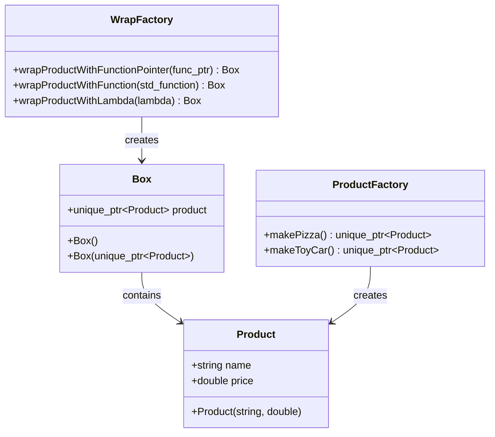

# C++模板方法模式实现设计

## 概述

本设计文档描述了在C++中实现模板方法模式的完整方案。模板方法模式是一种行为设计模式，它定义了一个算法的骨架，而将一些步骤延迟到子类或外部方法中实现。在C++中，我们可以通过函数指针、std::function、lambda表达式和模板等多种方式来实现这一模式。

## 技术栈与依赖

- **语言版本**: C++11或更高版本
- **标准库**: `<functional>`, `<memory>`, `<iostream>`, `<string>`
- **编译器**: 支持C++11标准的编译器（GCC 4.8+, Clang 3.3+, MSVC 2013+）

## 架构设计

### 核心组件架构



### 模板方法实现策略

#### 1. 函数指针方式
- **特点**: C风格，兼容性最好，性能开销最小
- **使用场景**: 需要与C代码兼容或对性能要求极高的场景

#### 2. std::function方式
- **特点**: 现代C++风格，支持可调用对象包装
- **使用场景**: 需要灵活性和类型安全的一般应用场景

#### 3. Lambda表达式方式
- **特点**: 最灵活，支持闭包和状态捕获
- **使用场景**: 需要捕获外部变量或内联定义逻辑的场景

#### 4. 模板方式
- **特点**: 编译时多态，零运行时开销
- **使用场景**: 对性能要求最高且类型在编译时确定的场景

## 核心实现

### 产品类设计

| 组件 | 职责 | 实现要点 |
|------|------|----------|
| Product | 基础产品实体 | 包含name和price属性，支持RAII |
| Box | 产品包装容器 | 使用unique_ptr管理产品生命周期 |
| ProductFactory | 产品创建工厂 | 提供不同类型产品的创建方法 |

### 模板方法实现

#### 函数指针实现
```cpp
// 函数签名定义
typedef std::unique_ptr<Product>(*ProductCreator)();

// 模板方法实现
Box wrapProductWithFunctionPointer(ProductCreator creator) {
    Box box;
    auto product = creator();          // 委托给外部方法
    box.product = std::move(product);  // 算法框架的固定部分
    return box;
}
```

#### std::function实现
```cpp
// 使用std::function包装可调用对象
Box wrapProductWithFunction(std::function<std::unique_ptr<Product>()> creator) {
    Box box;
    auto product = creator();          // 委托给外部方法
    box.product = std::move(product);  // 算法框架的固定部分
    return box;
}
```

#### 模板实现
```cpp
// 模板方式，编译时确定类型
template<typename ProductCreator>
Box wrapProductWithLambda(ProductCreator creator) {
    Box box;
    auto product = creator();          // 委托给外部方法
    box.product = std::move(product);  // 算法框架的固定部分
    return box;
}
```

## 使用模式与实例


