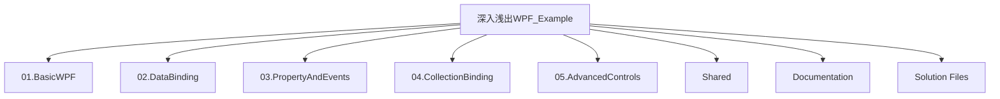
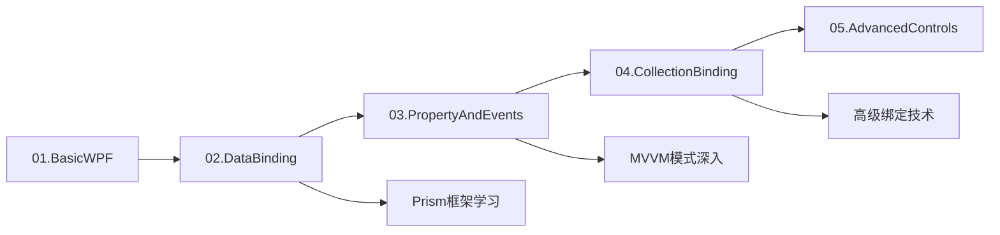

# WPF项目整合设计方案：深入浅出WPF_Example

## 1. 项目概述

### 1.1 整合目标
将当前WPF文件夹中的多个独立WPF示例项目整合为一个统一的解决方案"深入浅出WPF_Example"，便于学习和管理WPF相关技术。

### 1.2 当前项目结构分析
```
WPF文件夹/
├── WpfApp1/ - 基础WPF应用
├── WpfApp2/ - 基础WPF应用
├── WpfApp_Binding_no_path/ - Binding无路径示例
├── WpfApp_Binding指定源方法/ - Binding源指定方法
├── WpfApp_Bing源与路径/ - Binding源与路径
├── WpfApp_bing/ - 完整的Binding示例（包含Prism框架）
├── WpfApp_为对象属性赋值/ - 对象属性赋值
├── WpfApp_事件处理器/ - 事件处理机制
├── WpfApp_属性标签/ - 属性标签使用
├── WpfApp_标签扩展/ - 标签扩展机制
├── WpfApp_集合对象作为列表控件的ItemSource/ - 集合绑定
└── WpfDiagram-master/ - 图表控件库
```

### 1.3 技术栈识别
- **.NET 8.0**: 目标框架
- **WPF**: 用户界面框架
- **Prism**: MVVM框架（部分项目）
- **XAML**: 声明式UI标记语言
- **C#**: 主要编程语言

## 2. 整合架构设计

### 2.1 解决方案结构
```
深入浅出WPF_Example.sln
├── 01.BasicWPF/ 
│   ├── WpfApp1/
│   └── WpfApp2/
├── 02.DataBinding/
│   ├── WpfApp_Binding_no_path/
│   ├── WpfApp_Binding指定源方法/
│   ├── WpfApp_Bing源与路径/
│   └── WpfApp_bing/ (主要示例)
├── 03.PropertyAndEvents/
│   ├── WpfApp_为对象属性赋值/
│   ├── WpfApp_事件处理器/
│   ├── WpfApp_属性标签/
│   └── WpfApp_标签扩展/
├── 04.CollectionBinding/
│   └── WpfApp_集合对象作为列表控件的ItemSource/
├── 05.AdvancedControls/
│   └── WpfDiagram-master/
└── Shared/
    ├── Common/
    ├── Models/
    └── Resources/
```

### 2.2 项目分类逻辑

#### 2.2.1 基础WPF (01.BasicWPF)
- **目标**: 演示WPF应用程序的基本结构
- **内容**: 窗口创建、基本控件使用
- **学习顺序**: 第一阶段

#### 2.2.2 数据绑定 (02.DataBinding)
- **目标**: 深入理解WPF的Binding机制
- **核心示例**: WpfApp_bing项目（包含Prism框架对比）
- **学习顺序**: 第二阶段

#### 2.2.3 属性与事件 (03.PropertyAndEvents)
- **目标**: 掌握WPF的属性系统和事件处理
- **内容**: 依赖属性、附加属性、路由事件
- **学习顺序**: 第三阶段

#### 2.2.4 集合绑定 (04.CollectionBinding)
- **目标**: 学习集合数据的绑定技术
- **内容**: ItemsControl、ListView、DataGrid的数据绑定
- **学习顺序**: 第四阶段

#### 2.2.5 高级控件 (05.AdvancedControls)
- **目标**: 学习自定义控件和第三方控件库
- **内容**: 图表控件、自定义用户控件
- **学习顺序**: 第五阶段

## 3. 文件夹结构设计

### 3.1 根目录结构


### 3.2 共享资源设计 (Shared)
```
Shared/
├── Common/
│   ├── Converters/          # 值转换器
│   ├── Behaviors/           # 行为类
│   ├── AttachedProperties/  # 附加属性
│   └── Extensions/          # 扩展方法
├── Models/
│   ├── Student.cs          # 通用学生模型
│   ├── Person.cs           # 通用人员模型
│   └── BaseModels/         # 基础模型类
├── Resources/
│   ├── Styles/             # 样式资源
│   ├── Templates/          # 模板资源
│   ├── Images/             # 图片资源
│   └── Dictionaries/       # 资源字典
└── ViewModels/
    ├── BaseViewModel.cs    # 基础ViewModel
    └── Common/             # 通用ViewModel
```

### 3.3 文档结构 (Documentation)
```
Documentation/
├── README.md                    # 总体介绍
├── LearningPath.md             # 学习路径指南
├── WPF_Concepts/
│   ├── Binding_Mechanism.md    # 绑定机制详解
│   ├── MVVM_Pattern.md         # MVVM模式
│   ├── Prism_Framework.md      # Prism框架
│   └── Advanced_Topics.md      # 高级主题
├── Examples/
│   ├── 01_Basic_Examples.md    # 基础示例说明
│   ├── 02_Binding_Examples.md  # 绑定示例说明
│   ├── 03_Property_Examples.md # 属性示例说明
│   ├── 04_Collection_Examples.md # 集合示例说明
│   └── 05_Advanced_Examples.md # 高级示例说明
└── Comparisons/
    ├── WPF_vs_Prism.md         # WPF与Prism对比
    ├── Qt_vs_WPF.md            # Qt与WPF对比
    └── Best_Practices.md       # 最佳实践
```

## 4. 项目配置管理

### 4.1 解决方案文件配置
```
Microsoft Visual Studio Solution File, Format Version 12.00
# Visual Studio Version 17
VisualStudioVersion = 17.0.31903.59
MinimumVisualStudioVersion = 10.0.40219.1

# 解决方案文件夹
Project("{2150E333-8FDC-42A3-9474-1A3956D46DE8}") = "01.BasicWPF", "01.BasicWPF", "{11111111-1111-1111-1111-111111111111}"
EndProject
Project("{2150E333-8FDC-42A3-9474-1A3956D46DE8}") = "02.DataBinding", "02.DataBinding", "{22222222-2222-2222-2222-222222222222}"
EndProject
Project("{2150E333-8FDC-42A3-9474-1A3956D46DE8}") = "03.PropertyAndEvents", "03.PropertyAndEvents", "{33333333-3333-3333-3333-333333333333}"
EndProject
Project("{2150E333-8FDC-42A3-9474-1A3956D46DE8}") = "04.CollectionBinding", "04.CollectionBinding", "{44444444-4444-4444-4444-444444444444}"
EndProject
Project("{2150E333-8FDC-42A3-9474-1A3956D46DE8}") = "05.AdvancedControls", "05.AdvancedControls", "{55555555-5555-5555-5555-555555555555}"
EndProject
Project("{2150E333-8FDC-42A3-9474-1A3956D46DE8}") = "Shared", "Shared", "{66666666-6666-6666-6666-666666666666}"
EndProject

# 01.BasicWPF 项目组
Project("{9A19103F-16F7-4668-BE54-9A1E7A4F7556}") = "WpfApp1", "01.BasicWPF\WpfApp1\WpfApp1.csproj", "{A1111111-1111-1111-1111-111111111111}"
EndProject
Project("{9A19103F-16F7-4668-BE54-9A1E7A4F7556}") = "WpfApp2", "01.BasicWPF\WpfApp2\WpfApp2.csproj", "{A2222222-2222-2222-2222-222222222222}"
EndProject

# 02.DataBinding 项目组
Project("{9A19103F-16F7-4668-BE54-9A1E7A4F7556}") = "WpfApp_Binding_no_path", "02.DataBinding\WpfApp_Binding_no_path\WpfApp_Binding_no_path.csproj", "{B1111111-1111-1111-1111-111111111111}"
EndProject
Project("{9A19103F-16F7-4668-BE54-9A1E7A4F7556}") = "WpfApp_Binding指定源方法", "02.DataBinding\WpfApp_Binding指定源方法\WpfApp_Binding指定源方法.csproj", "{B2222222-2222-2222-2222-222222222222}"
EndProject
Project("{9A19103F-16F7-4668-BE54-9A1E7A4F7556}") = "WpfApp_Bing源与路径", "02.DataBinding\WpfApp_Bing源与路径\WpfApp_Bing源与路径.csproj", "{B3333333-3333-3333-3333-333333333333}"
EndProject
Project("{9A19103F-16F7-4668-BE54-9A1E7A4F7556}") = "WpfApp_bing", "02.DataBinding\WpfApp_bing\WpfApp_bing.csproj", "{B4444444-4444-4444-4444-444444444444}"
EndProject

# 03.PropertyAndEvents 项目组
Project("{9A19103F-16F7-4668-BE54-9A1E7A4F7556}") = "WpfApp_为对象属性赋值", "03.PropertyAndEvents\WpfApp_为对象属性赋值\WpfApp_为对象属性赋值.csproj", "{C1111111-1111-1111-1111-111111111111}"
EndProject
Project("{9A19103F-16F7-4668-BE54-9A1E7A4F7556}") = "WpfApp_事件处理器", "03.PropertyAndEvents\WpfApp_事件处理器\WpfApp_事件处理器.csproj", "{C2222222-2222-2222-2222-222222222222}"
EndProject
Project("{9A19103F-16F7-4668-BE54-9A1E7A4F7556}") = "WpfApp_属性标签", "03.PropertyAndEvents\WpfApp_属性标签\WpfApp_属性标签.csproj", "{C3333333-3333-3333-3333-333333333333}"
EndProject
Project("{9A19103F-16F7-4668-BE54-9A1E7A4F7556}") = "WpfApp_标签扩展", "03.PropertyAndEvents\WpfApp_标签扩展\WpfApp_标签扩展.csproj", "{C4444444-4444-4444-4444-444444444444}"
EndProject

# 04.CollectionBinding 项目组
Project("{9A19103F-16F7-4668-BE54-9A1E7A4F7556}") = "WpfApp_集合对象作为列表控件的ItemSource", "04.CollectionBinding\WpfApp_集合对象作为列表控件的ItemSource\WpfApp_集合对象作为列表控件的ItemSource.csproj", "{D1111111-1111-1111-1111-111111111111}"
EndProject

# 05.AdvancedControls 项目组  
Project("{9A19103F-16F7-4668-BE54-9A1E7A4F7556}") = "Aga.Diagrams", "05.AdvancedControls\WpfDiagram-master\Aga.Diagrams\Aga.Diagrams.csproj", "{E1111111-1111-1111-1111-111111111111}"
EndProject
Project("{9A19103F-16F7-4668-BE54-9A1E7A4F7556}") = "TestApp", "05.AdvancedControls\WpfDiagram-master\TestApp\TestApp.csproj", "{E2222222-2222-2222-2222-222222222222}"
EndProject

# Shared 项目组
Project("{9A19103F-16F7-4668-BE54-9A1E7A4F7556}") = "Shared.Common", "Shared\Common\Shared.Common.csproj", "{F1111111-1111-1111-1111-111111111111}"
EndProject
Project("{9A19103F-16F7-4668-BE54-9A1E7A4F7556}") = "Shared.Models", "Shared\Models\Shared.Models.csproj", "{F2222222-2222-2222-2222-222222222222}"
EndProject

Global
	GlobalSection(SolutionConfigurationPlatforms) = preSolution
		Debug|Any CPU = Debug|Any CPU
		Release|Any CPU = Release|Any CPU
	EndGlobalSection
	
	GlobalSection(ProjectConfigurationPlatforms) = postSolution
		{A1111111-1111-1111-1111-111111111111}.Debug|Any CPU.ActiveCfg = Debug|Any CPU
		{A1111111-1111-1111-1111-111111111111}.Debug|Any CPU.Build.0 = Debug|Any CPU
		{A1111111-1111-1111-1111-111111111111}.Release|Any CPU.ActiveCfg = Release|Any CPU
		{A1111111-1111-1111-1111-111111111111}.Release|Any CPU.Build.0 = Release|Any CPU
		
		{A2222222-2222-2222-2222-222222222222}.Debug|Any CPU.ActiveCfg = Debug|Any CPU
		{A2222222-2222-2222-2222-222222222222}.Debug|Any CPU.Build.0 = Debug|Any CPU
		{A2222222-2222-2222-2222-222222222222}.Release|Any CPU.ActiveCfg = Release|Any CPU
		{A2222222-2222-2222-2222-222222222222}.Release|Any CPU.Build.0 = Release|Any CPU
		
		{B1111111-1111-1111-1111-111111111111}.Debug|Any CPU.ActiveCfg = Debug|Any CPU
		{B1111111-1111-1111-1111-111111111111}.Debug|Any CPU.Build.0 = Debug|Any CPU
		{B1111111-1111-1111-1111-111111111111}.Release|Any CPU.ActiveCfg = Release|Any CPU
		{B1111111-1111-1111-1111-111111111111}.Release|Any CPU.Build.0 = Release|Any CPU
		
		{B2222222-2222-2222-2222-222222222222}.Debug|Any CPU.ActiveCfg = Debug|Any CPU
		{B2222222-2222-2222-2222-222222222222}.Debug|Any CPU.Build.0 = Debug|Any CPU
		{B2222222-2222-2222-2222-222222222222}.Release|Any CPU.ActiveCfg = Release|Any CPU
		{B2222222-2222-2222-2222-222222222222}.Release|Any CPU.Build.0 = Release|Any CPU
		
		{B3333333-3333-3333-3333-333333333333}.Debug|Any CPU.ActiveCfg = Debug|Any CPU
		{B3333333-3333-3333-3333-333333333333}.Debug|Any CPU.Build.0 = Debug|Any CPU
		{B3333333-3333-3333-3333-333333333333}.Release|Any CPU.ActiveCfg = Release|Any CPU
		{B3333333-3333-3333-3333-333333333333}.Release|Any CPU.Build.0 = Release|Any CPU
		
		{B4444444-4444-4444-4444-444444444444}.Debug|Any CPU.ActiveCfg = Debug|Any CPU
		{B4444444-4444-4444-4444-444444444444}.Debug|Any CPU.Build.0 = Debug|Any CPU
		{B4444444-4444-4444-4444-444444444444}.Release|Any CPU.ActiveCfg = Release|Any CPU
		{B4444444-4444-4444-4444-444444444444}.Release|Any CPU.Build.0 = Release|Any CPU
		
		{C1111111-1111-1111-1111-111111111111}.Debug|Any CPU.ActiveCfg = Debug|Any CPU
		{C1111111-1111-1111-1111-111111111111}.Debug|Any CPU.Build.0 = Debug|Any CPU
		{C1111111-1111-1111-1111-111111111111}.Release|Any CPU.ActiveCfg = Release|Any CPU
		{C1111111-1111-1111-1111-111111111111}.Release|Any CPU.Build.0 = Release|Any CPU
		
		{C2222222-2222-2222-2222-222222222222}.Debug|Any CPU.ActiveCfg = Debug|Any CPU
		{C2222222-2222-2222-2222-222222222222}.Debug|Any CPU.Build.0 = Debug|Any CPU
		{C2222222-2222-2222-2222-222222222222}.Release|Any CPU.ActiveCfg = Release|Any CPU
		{C2222222-2222-2222-2222-222222222222}.Release|Any CPU.Build.0 = Release|Any CPU
		
		{C3333333-3333-3333-3333-333333333333}.Debug|Any CPU.ActiveCfg = Debug|Any CPU
		{C3333333-3333-3333-3333-333333333333}.Debug|Any CPU.Build.0 = Debug|Any CPU
		{C3333333-3333-3333-3333-333333333333}.Release|Any CPU.ActiveCfg = Release|Any CPU
		{C3333333-3333-3333-3333-333333333333}.Release|Any CPU.Build.0 = Release|Any CPU
		
		{C4444444-4444-4444-4444-444444444444}.Debug|Any CPU.ActiveCfg = Debug|Any CPU
		{C4444444-4444-4444-4444-444444444444}.Debug|Any CPU.Build.0 = Debug|Any CPU
		{C4444444-4444-4444-4444-444444444444}.Release|Any CPU.ActiveCfg = Release|Any CPU
		{C4444444-4444-4444-4444-444444444444}.Release|Any CPU.Build.0 = Release|Any CPU
		
		{D1111111-1111-1111-1111-111111111111}.Debug|Any CPU.ActiveCfg = Debug|Any CPU
		{D1111111-1111-1111-1111-111111111111}.Debug|Any CPU.Build.0 = Debug|Any CPU
		{D1111111-1111-1111-1111-111111111111}.Release|Any CPU.ActiveCfg = Release|Any CPU
		{D1111111-1111-1111-1111-111111111111}.Release|Any CPU.Build.0 = Release|Any CPU
		
		{E1111111-1111-1111-1111-111111111111}.Debug|Any CPU.ActiveCfg = Debug|Any CPU
		{E1111111-1111-1111-1111-111111111111}.Debug|Any CPU.Build.0 = Debug|Any CPU
		{E1111111-1111-1111-1111-111111111111}.Release|Any CPU.ActiveCfg = Release|Any CPU
		{E1111111-1111-1111-1111-111111111111}.Release|Any CPU.Build.0 = Release|Any CPU
		
		{E2222222-2222-2222-2222-222222222222}.Debug|Any CPU.ActiveCfg = Debug|Any CPU
		{E2222222-2222-2222-2222-222222222222}.Debug|Any CPU.Build.0 = Debug|Any CPU
		{E2222222-2222-2222-2222-222222222222}.Release|Any CPU.ActiveCfg = Release|Any CPU
		{E2222222-2222-2222-2222-222222222222}.Release|Any CPU.Build.0 = Release|Any CPU
		
		{F1111111-1111-1111-1111-111111111111}.Debug|Any CPU.ActiveCfg = Debug|Any CPU
		{F1111111-1111-1111-1111-111111111111}.Debug|Any CPU.Build.0 = Debug|Any CPU
		{F1111111-1111-1111-1111-111111111111}.Release|Any CPU.ActiveCfg = Release|Any CPU
		{F1111111-1111-1111-1111-111111111111}.Release|Any CPU.Build.0 = Release|Any CPU
		
		{F2222222-2222-2222-2222-222222222222}.Debug|Any CPU.ActiveCfg = Debug|Any CPU
		{F2222222-2222-2222-2222-222222222222}.Debug|Any CPU.Build.0 = Debug|Any CPU
		{F2222222-2222-2222-2222-222222222222}.Release|Any CPU.ActiveCfg = Release|Any CPU
		{F2222222-2222-2222-2222-222222222222}.Release|Any CPU.Build.0 = Release|Any CPU
	EndGlobalSection
	
	GlobalSection(SolutionProperties) = preSolution
		HideSolutionNode = FALSE
	EndGlobalSection
	
	GlobalSection(NestedProjects) = preSolution
		{A1111111-1111-1111-1111-111111111111} = {11111111-1111-1111-1111-111111111111}
		{A2222222-2222-2222-2222-222222222222} = {11111111-1111-1111-1111-111111111111}
		{B1111111-1111-1111-1111-111111111111} = {22222222-2222-2222-2222-222222222222}
		{B2222222-2222-2222-2222-222222222222} = {22222222-2222-2222-2222-222222222222}
		{B3333333-3333-3333-3333-333333333333} = {22222222-2222-2222-2222-222222222222}
		{B4444444-4444-4444-4444-444444444444} = {22222222-2222-2222-2222-222222222222}
		{C1111111-1111-1111-1111-111111111111} = {33333333-3333-3333-3333-333333333333}
		{C2222222-2222-2222-2222-222222222222} = {33333333-3333-3333-3333-333333333333}
		{C3333333-3333-3333-3333-333333333333} = {33333333-3333-3333-3333-333333333333}
		{C4444444-4444-4444-4444-444444444444} = {33333333-3333-3333-3333-333333333333}
		{D1111111-1111-1111-1111-111111111111} = {44444444-4444-4444-4444-444444444444}
		{E1111111-1111-1111-1111-111111111111} = {55555555-5555-5555-5555-555555555555}
		{E2222222-2222-2222-2222-222222222222} = {55555555-5555-5555-5555-555555555555}
		{F1111111-1111-1111-1111-111111111111} = {66666666-6666-6666-6666-666666666666}
		{F2222222-2222-2222-2222-222222222222} = {66666666-6666-6666-6666-666666666666}
	EndGlobalSection
	
	GlobalSection(ExtensibilityGlobals) = postSolution
		SolutionGuid = {12345678-1234-1234-1234-123456789012}
	EndGlobalSection
EndGlobal
```

### 4.2 统一项目配置
```xml
<!-- Directory.Build.props -->
<Project>
  <PropertyGroup>
    <TargetFramework>net8.0-windows</TargetFramework>
    <UseWPF>true</UseWPF>
    <ImplicitUsings>enable</ImplicitUsings>
    <Nullable>enable</Nullable>
  </PropertyGroup>
  
  <ItemGroup>
    <PackageReference Include="Prism.Wpf" Version="8.1.97" />
    <PackageReference Include="Microsoft.Extensions.DependencyInjection" Version="8.0.0" />
  </ItemGroup>
</Project>
```

### 4.3 NuGet包管理
```xml
<!-- Directory.Packages.props -->
<Project>
  <PropertyGroup>
    <ManagePackageVersionsCentrally>true</ManagePackageVersionsCentrally>
  </PropertyGroup>
  
  <ItemGroup>
    <PackageVersion Include="Prism.Wpf" Version="8.1.97" />
    <PackageVersion Include="Prism.DryIoc" Version="8.1.97" />
    <PackageVersion Include="Microsoft.Extensions.Hosting" Version="8.0.0" />
  </ItemGroup>
</Project>
```

## 5. 代码整合策略

### 5.1 命名空间重构
```
原始命名空间 → 新命名空间
WpfApp1 → 深入浅出WPF_Example.BasicWPF.App1
WpfApp_bing → 深入浅出WPF_Example.DataBinding.BindingExample
WpfApp_事件处理器 → 深入浅出WPF_Example.PropertyAndEvents.EventHandling
```

### 5.2 共享代码提取
#### 5.2.1 学生模型统一
```csharp
// Shared/Models/Student.cs
namespace 深入浅出WPF_Example.Shared.Models
{
    public class Student : BindableBase
    {
        private string _name;
        public string Name
        {
            get => _name;
            set => SetProperty(ref _name, value);
        }
        
        private int _age;
        public int Age
        {
            get => _age;
            set => SetProperty(ref _age, value);
        }
        
        private string _email;
        public string Email
        {
            get => _email;
            set => SetProperty(ref _email, value);
        }
    }
}
```

#### 5.2.2 基础ViewModel
```csharp
// Shared/ViewModels/BaseViewModel.cs
namespace 深入浅出WPF_Example.Shared.ViewModels
{
    public abstract class BaseViewModel : BindableBase
    {
        private string _title;
        public string Title
        {
            get => _title;
            set => SetProperty(ref _title, value);
        }
        
        private bool _isBusy;
        public bool IsBusy
        {
            get => _isBusy;
            set => SetProperty(ref _isBusy, value);
        }
    }
}
```

## 6. 具体实施步骤

### 6.1 第一步：创建解决方案文件
```powershell
# 在WPF根目录下执行
cd d:\CsharpCode\Wpf

# 创建新的解决方案
dotnet new sln -n "深入浅出WPF_Example"
```

### 6.2 第二步：创建目录结构
```powershell
# 创建分类文件夹
mkdir "01.BasicWPF"
mkdir "02.DataBinding" 
mkdir "03.PropertyAndEvents"
mkdir "04.CollectionBinding"
mkdir "05.AdvancedControls"
mkdir "Shared"
mkdir "Documentation"
```

### 6.3 第三步：移动项目到对应目录
```powershell
# 移动基础WPF项目
move "WpfApp1" "01.BasicWPF\"
move "WpfApp2" "01.BasicWPF\"

# 移动数据绑定项目
move "WpfApp_Binding_no_path" "02.DataBinding\"
move "WpfApp_Binding指定源方法" "02.DataBinding\"
move "WpfApp_Bing源与路径" "02.DataBinding\"
move "WpfApp_bing" "02.DataBinding\"

# 移动属性事件项目
move "WpfApp_为对象属性赋值" "03.PropertyAndEvents\"
move "WpfApp_事件处理器" "03.PropertyAndEvents\"
move "WpfApp_属性标签" "03.PropertyAndEvents\"
move "WpfApp_标签扩展" "03.PropertyAndEvents\"

# 移动集合绑定项目
move "WpfApp_集合对象作为列表控件的ItemSource" "04.CollectionBinding\"

# 移动高级控件项目
move "WpfDiagram-master" "05.AdvancedControls\"
```

### 6.4 第四步：添加项目到解决方案
```powershell
# 添加解决方案文件夹
dotnet sln add --solution-folder "01.BasicWPF" "01.BasicWPF\WpfApp1\WpfApp1.csproj"
dotnet sln add --solution-folder "01.BasicWPF" "01.BasicWPF\WpfApp2\WpfApp2.csproj"

# 添加数据绑定项目
dotnet sln add --solution-folder "02.DataBinding" "02.DataBinding\WpfApp_Binding_no_path\WpfApp_Binding_no_path.csproj"
dotnet sln add --solution-folder "02.DataBinding" "02.DataBinding\WpfApp_Binding指定源方法\WpfApp_Binding指定源方法.csproj"
dotnet sln add --solution-folder "02.DataBinding" "02.DataBinding\WpfApp_Bing源与路径\WpfApp_Bing源与路径.csproj"
dotnet sln add --solution-folder "02.DataBinding" "02.DataBinding\WpfApp_bing\WpfApp_bing.csproj"

# 添加属性事件项目
dotnet sln add --solution-folder "03.PropertyAndEvents" "03.PropertyAndEvents\WpfApp_为对象属性赋值\WpfApp_为对象属性赋值.csproj"
dotnet sln add --solution-folder "03.PropertyAndEvents" "03.PropertyAndEvents\WpfApp_事件处理器\WpfApp_事件处理器.csproj"
dotnet sln add --solution-folder "03.PropertyAndEvents" "03.PropertyAndEvents\WpfApp_属性标签\WpfApp_属性标签.csproj"
dotnet sln add --solution-folder "03.PropertyAndEvents" "03.PropertyAndEvents\WpfApp_标签扩展\WpfApp_标签扩展.csproj"

# 添加集合绑定项目
dotnet sln add --solution-folder "04.CollectionBinding" "04.CollectionBinding\WpfApp_集合对象作为列表控件的ItemSource\WpfApp_集合对象作为列表控件的ItemSource.csproj"

# 添加高级控件项目
dotnet sln add --solution-folder "05.AdvancedControls" "05.AdvancedControls\WpfDiagram-master\Aga.Diagrams\Aga.Diagrams.csproj"
dotnet sln add --solution-folder "05.AdvancedControls" "05.AdvancedControls\WpfDiagram-master\TestApp\TestApp.csproj"
```

### 6.5 第五步：创建批处理脚本自动化整合
#### 6.5.1 创建整合脚本 (IntegrateProjects.ps1)
```powershell
# IntegrateProjects.ps1 - WPF项目整合脚本
param(
    [string]$RootPath = "d:\CsharpCode\Wpf"
)

Write-Host "开始整合WPF项目到解决方案: 深入浅出WPF_Example" -ForegroundColor Green

# 设置工作目录
Set-Location $RootPath

# 第一步：创建解决方案
Write-Host "1. 创建解决方案文件..." -ForegroundColor Yellow
if (Test-Path "深入浅出WPF_Example.sln") {
    Remove-Item "深入浅出WPF_Example.sln" -Force
}
dotnet new sln -n "深入浅出WPF_Example"

# 第二步：创建目录结构
Write-Host "2. 创建目录结构..." -ForegroundColor Yellow
$folders = @(
    "01.BasicWPF",
    "02.DataBinding", 
    "03.PropertyAndEvents",
    "04.CollectionBinding",
    "05.AdvancedControls",
    "Shared\Common",
    "Shared\Models",
    "Shared\Resources",
    "Documentation"
)

foreach ($folder in $folders) {
    if (!(Test-Path $folder)) {
        New-Item -Path $folder -ItemType Directory -Force
        Write-Host "   创建文件夹: $folder" -ForegroundColor Gray
    }
}

# 第三步：移动项目
Write-Host "3. 移动项目到对应目录..." -ForegroundColor Yellow

# 基础WPF项目移动
if (Test-Path "WpfApp1") { Move-Item "WpfApp1" "01.BasicWPF\" -Force }
if (Test-Path "WpfApp2") { Move-Item "WpfApp2" "01.BasicWPF\" -Force }

# 数据绑定项目移动
$bindingProjects = @(
    "WpfApp_Binding_no_path",
    "WpfApp_Binding指定源方法",
    "WpfApp_Bing源与路径",
    "WpfApp_bing"
)

foreach ($project in $bindingProjects) {
    if (Test-Path $project) {
        Move-Item $project "02.DataBinding\" -Force
        Write-Host "   移动项目: $project -> 02.DataBinding" -ForegroundColor Gray
    }
}

# 属性事件项目移动
$propertyProjects = @(
    "WpfApp_为对象属性赋值",
    "WpfApp_事件处理器",
    "WpfApp_属性标签",
    "WpfApp_标签扩展"
)

foreach ($project in $propertyProjects) {
    if (Test-Path $project) {
        Move-Item $project "03.PropertyAndEvents\" -Force
        Write-Host "   移动项目: $project -> 03.PropertyAndEvents" -ForegroundColor Gray
    }
}

# 集合绑定项目移动
if (Test-Path "WpfApp_集合对象作为列表控件的ItemSource") {
    Move-Item "WpfApp_集合对象作为列表控件的ItemSource" "04.CollectionBinding\" -Force
    Write-Host "   移动项目: WpfApp_集合对象作为列表控件的ItemSource -> 04.CollectionBinding" -ForegroundColor Gray
}

# 高级控件项目移动
if (Test-Path "WpfDiagram-master") {
    Move-Item "WpfDiagram-master" "05.AdvancedControls\" -Force
    Write-Host "   移动项目: WpfDiagram-master -> 05.AdvancedControls" -ForegroundColor Gray
}

# 第四步：扫描并添加所有csproj文件到解决方案
Write-Host "4. 添加项目到解决方案..." -ForegroundColor Yellow

# 查找所有.csproj文件
$csprojFiles = Get-ChildItem -Path . -Filter "*.csproj" -Recurse

foreach ($csproj in $csprojFiles) {
    $relativePath = $csproj.FullName.Replace((Get-Location).Path + "\", "")
    $folderName = Split-Path (Split-Path $relativePath -Parent) -Leaf
    
    try {
        dotnet sln add $relativePath 2>$null
        Write-Host "   添加项目: $relativePath" -ForegroundColor Gray
    }
    catch {
        Write-Host "   跳过项目: $relativePath (可能已存在)" -ForegroundColor DarkGray
    }
}

Write-Host "5. 整合完成！" -ForegroundColor Green
Write-Host "解决方案文件: 深入浅出WPF_Example.sln" -ForegroundColor Cyan
Write-Host "您现在可以在Visual Studio中打开此解决方案文件" -ForegroundColor Cyan
```

#### 6.5.2 执行整合
```powershell
# 在PowerShell中执行
.\IntegrateProjects.ps1
```

## 7. 学习路径设计

### 7.1 渐进式学习路径


### 7.2 知识点映射
#### 7.2.1 基础阶段
- WPF应用程序结构
- XAML语法基础
- 基本控件使用

#### 7.2.2 绑定阶段
- 数据绑定原理
- 绑定模式和方向
- Prism框架优势

#### 7.2.3 深入阶段
- 依赖属性系统
- 路由事件机制
- MVVM设计模式

#### 7.2.4 高级阶段
- 自定义控件开发
- 性能优化技术
- 架构设计模式

## 8. 工具和辅助文件

### 8.1 构建脚本
```powershell
# Build.ps1
Write-Host "构建深入浅出WPF_Example解决方案..."
dotnet build "深入浅出WPF_Example.sln" --configuration Release
Write-Host "构建完成!"
```

### 8.2 清理脚本
```powershell
# Clean.ps1
Write-Host "清理构建输出..."
Get-ChildItem -Path . -Include bin,obj -Recurse | Remove-Item -Recurse -Force
Write-Host "清理完成!"
```

### 8.3 启动脚本
```powershell
# Start.ps1
param(
    [string]$Project = "WpfApp_bing"
)

Write-Host "启动项目: $Project"
dotnet run --project ".\02.DataBinding\$Project\$Project.csproj"
```

## 9. 版本控制策略

### 9.1 Git忽略文件配置
```gitignore
# Visual Studio
.vs/
bin/
obj/
*.user
*.suo

# .NET
*.dll
*.exe
*.pdb

# 临时文件
*.tmp
*.cache
```

### 9.2 分支管理
- **main**: 主分支，稳定版本
- **feature/**: 功能开发分支
- **example/**: 示例添加分支
- **docs/**: 文档更新分支

## 10. 质量保证

### 10.1 代码规范
- 统一使用C# 12.0语法特性
- 遵循Microsoft C#编码规范
- 使用nullable引用类型
- 保持代码注释的完整性

### 10.2 项目结构验证
- 确保每个项目都有完整的示例
- 验证项目间的依赖关系
- 检查共享资源的正确引用
- 测试构建和运行的完整性