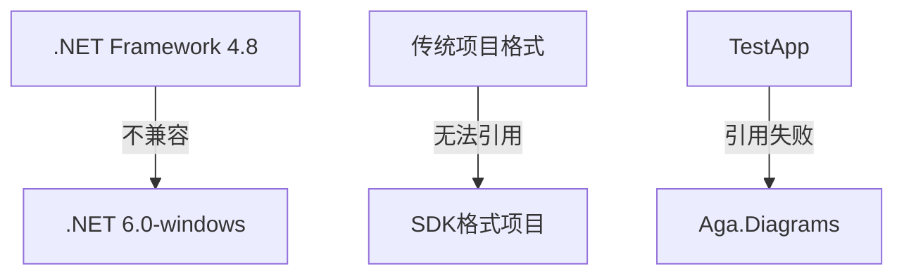
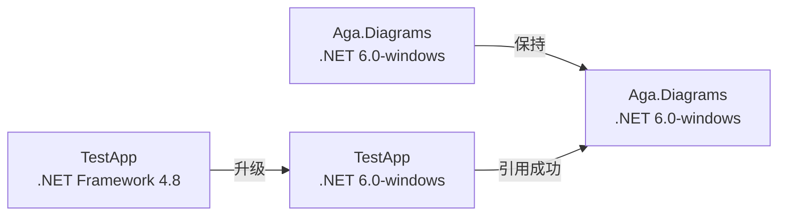

# 项目引用兼容性修复设计文档

## 概述

本文档描述了在Visual Studio 2022环境下，解决WpfDiagram项目中因目标框架版本不一致导致的项目引用兼容性问题的设计方案。

## 问题分析

### 错误现象
```
项目"..\Aga.Diagrams\Aga.Diagrams.csproj"指向"net6.0-windows"。它不能被指向".NETFramework,Version=v4.8"的项目引用。
```

### 根本原因
- **Aga.Diagrams项目**：使用新式SDK格式，目标框架为`net6.0-windows`
- **TestApp项目**：使用传统项目格式，目标框架为`.NET Framework v4.8`
- **.NET Framework项目无法引用.NET 6项目**：这是.NET生态系统的设计限制

### 技术背景


## 解决方案架构

### 方案选择对比

| 解决方案 | 优点 | 缺点 | 推荐度 |
|---------|------|------|--------|
| 统一升级到.NET 6 | 使用最新技术栈 | 需要全面测试兼容性 | ⭐⭐⭐⭐⭐ |
| 降级到.NET Framework | 保持原有稳定性 | 无法享受新特性 | ⭐⭐⭐ |
| 多目标框架 | 兼容性最好 | 维护复杂度高 | ⭐⭐⭐⭐ |

### 推荐方案：统一升级到.NET 6

#### 1. 项目迁移策略


#### 2. 迁移步骤设计

**第一阶段：TestApp项目转换**
- 将TestApp从传统项目格式转换为SDK格式
- 更新目标框架从`netframework48`到`net6.0-windows`
- 保留WPF支持配置

**第二阶段：依赖项更新**
- 移除传统的程序集引用
- 添加必要的包引用（如果需要）
- 更新AssemblyInfo配置

**第三阶段：配置文件适配**
- 移除或更新app.config中的framework配置
- 确保运行时配置兼容性

#### 3. 新项目文件结构

**TestApp.csproj（目标结构）**
```xml
<Project Sdk="Microsoft.NET.Sdk">
  <PropertyGroup>
    <OutputType>WinExe</OutputType>
    <TargetFramework>net6.0-windows</TargetFramework>
    <UseWPF>true</UseWPF>
    <AssemblyName>TestApp</AssemblyName>
    <RootNamespace>TestApp</RootNamespace>
    <GenerateAssemblyInfo>false</GenerateAssemblyInfo>
  </PropertyGroup>
  
  <ItemGroup>
    <ProjectReference Include="..\Aga.Diagrams\Aga.Diagrams.csproj" />
  </ItemGroup>
</Project>
```

### 备选方案：多目标框架支持

如果需要保持向后兼容性，可以配置Aga.Diagrams支持多目标框架：

```xml
<Project Sdk="Microsoft.NET.Sdk">
  <PropertyGroup>
    <TargetFrameworks>net48;net6.0-windows</TargetFrameworks>
    <UseWPF>true</UseWPF>
  </PropertyGroup>
</Project>
```

## 实施方案

### 文件操作清单

**需要修改的文件：**
1. `TestApp\TestApp.csproj` - 完全重写为SDK格式
2. `TestApp\app.config` - 移除或简化配置
3. 可能需要调整的代码文件（如有API变更）

**需要保留的文件：**
1. 所有源代码文件（.cs, .xaml）
2. 资源文件
3. AssemblyInfo.cs（禁用自动生成）

### 风险评估与缓解

| 风险类型 | 风险描述 | 缓解措施 |
|---------|----------|----------|
| API兼容性 | .NET 6可能移除某些API | 编译测试，替换废弃API |
| 运行时兼容性 | 运行时行为差异 | 全面功能测试 |
| 部署复杂性 | 需要安装.NET 6运行时 | 文档更新，自包含部署 |

### 测试策略

**编译测试：**
- 确保所有项目编译通过
- 验证项目间引用正常工作

**功能测试：**
- 图形控件基本功能
- 拖拽操作
- 连接线绘制
- 选择和编辑功能

**兼容性测试：**
- 在不同Windows版本上测试
- 验证WPF渲染正常

## 技术细节

### 项目格式对比

| 特性 | 传统格式 | SDK格式 |
|------|----------|---------|
| 文件大小 | 大（200+行） | 小（10-20行） |
| 包管理 | packages.config | PackageReference |
| 编译速度 | 较慢 | 较快 |
| 工具支持 | 有限 | 完整 |

### 依赖关系图

```mermaid
graph TB
    subgraph "解决方案结构"
        A[WpfDiagrams.sln]
        B[Aga.Diagrams<br/>(.NET 6.0-windows)]
        C[TestApp<br/>(.NET 6.0-windows)]
        D[SemiconductorControlApp<br/>(待确认)]
    end
    
    A --> B
    A --> C
    A --> D
    C -->|项目引用| B
    D -->|项目引用| B
```

### 配置文件变更

**app.config处理：**
- .NET 6项目通常不需要app.config
- 如有必要，可转换为appsettings.json
- 运行时配置可在项目文件中指定

## 验证标准

### 成功标准
1. ✅ TestApp项目编译成功
2. ✅ 项目引用关系正常
3. ✅ 应用程序正常启动
4. ✅ 所有图形功能正常工作

### 回滚计划
如果升级遇到问题，可以：
1. 恢复原始项目文件
2. 考虑降级Aga.Diagrams到.NET Framework
3. 使用条件编译处理兼容性问题

## 附加考虑

### 长期维护
- .NET 6是LTS版本，支持周期长
- 统一技术栈便于维护
- 可享受性能和功能改进

### 性能影响
- .NET 6通常比.NET Framework性能更好
- WPF在.NET 6中持续优化
- 编译时间可能减少