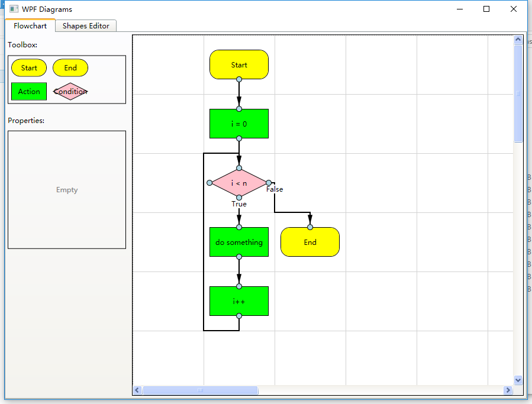
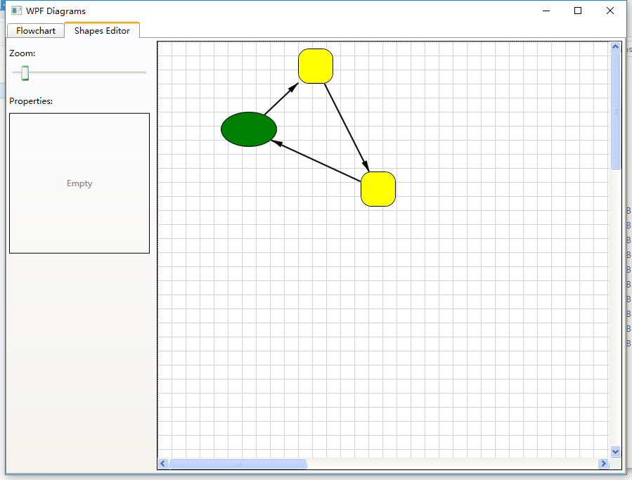

# WpfDiagram - WPF图表编辑器

一个功能强大的WPF图形化拖拽控件库，用于创建可交互的图表编辑器，支持流程图、拓扑图等多种图形编辑场景。





## 🚀 特性

- ✨ **丰富的图形元素**: 支持节点、连接线、端口等基础图形元素
- 🎯 **直观的交互操作**: 拖拽、选择、连接、调整大小等操作
- 🔧 **高度可扩展**: 基于接口设计，支持自定义节点和工具
- 🎨 **视觉反馈**: 基于WPF Adorner的实时视觉提示
- 📦 **MVVM友好**: 支持数据绑定和命令模式
- 🛠️ **工具系统**: 可插拔的工具架构，支持多种编辑模式

## 📋 项目结构

```
📁 Aga.Diagrams (核心库)
├── 📂 Adorners (装饰器 - 视觉反馈)
├── 📂 Controls (控件 - 基础UI元素)
│   ├── 📂 Node (节点相关)
│   ├── 📂 Ports (端口相关)
│   └── 📂 Links (连接线相关)
├── 📂 Tools (工具 - 交互处理)
├── 📂 Util (工具类)
└── 📂 themes (样式模板)

📁 TestApp (示例应用)
├── 📂 Flowchart (流程图示例)
├── 📂 ShapesExample (图形示例)
└── 📂 Properties (应用配置)
```

## 🔧 核心概念

### DiagramView
核心画布控件，提供：
- 网格显示和缩放
- 事件处理和分发
- 工具管理
- 选择管理

### 工具系统 (Tools)
- **InputTool**: 基础输入处理
- **MoveResizeTool**: 移动和调整大小
- **LinkTool**: 连接线创建
- **DragDropTool**: 拖放操作

### 装饰器系统 (Adorners)
- **SelectionAdorner**: 选择状态显示
- **MoveResizeAdorner**: 移动调整手柄
- **LinkAdorner**: 连接线预览
- **RubberbandAdorner**: 框选操作

### 控件层次
- **DiagramItem**: 所有图表元素基类
- **Node**: 节点控件，包含端口
- **Port**: 连接点，支持输入输出
- **Link**: 连接线，连接两个端口

## 🎯 快速开始

### 环境要求
- Visual Studio 2019+
- .NET Framework 4.0+
- WPF 支持

### 基本使用

```csharp
// 1. 创建图表视图
var diagramView = new DiagramView();

// 2. 设置控制器
diagramView.Controller = new MyController();

// 3. 创建节点
var node = new Node();
node.Content = "示例节点";
Canvas.SetLeft(node, 100);
Canvas.SetTop(node, 100);
diagramView.Children.Add(node);

// 4. 添加到容器
container.Children.Add(diagramView);
```

### 示例程序

项目包含两个完整示例：

1. **FlowchartEditor**: 完整的流程图编辑器
   - 展示MVVM模式应用
   - 自定义节点和连接线
   - 网格对齐和布局

2. **ShapesEditor**: 基础图形编辑器
   - 简单的拖拽操作
   - 基础选择功能

## 📚 学习资源

- [📖 项目架构分析](./项目架构分析.md) - 详细的架构说明和文件解析
- [🏗️ 系统架构图](./架构图.md) - 可视化的架构图表
- [💡 设计模式应用](./项目架构分析.md#设计模式应用) - 了解项目中使用的设计模式

## 🎓 适合学习

这个项目特别适合学习以下WPF技术：

- **自定义控件开发**
- **Adorner装饰器系统**
- **命令模式和数据绑定**
- **拖拽操作实现**
- **MVVM架构模式**
- **可扩展的插件架构**

## ⚠️ 注意事项

- 代码来自网络，版权归原作者所有
- 建议用于学习和参考，商业使用请注意版权
- 大量节点时需要考虑性能优化
- 项目缺少单元测试，修改时请谨慎

## 🤝 贡献

欢迎提交Issue和Pull Request来改进这个项目！

## 📄 许可证

本项目仅供学习参考使用。
