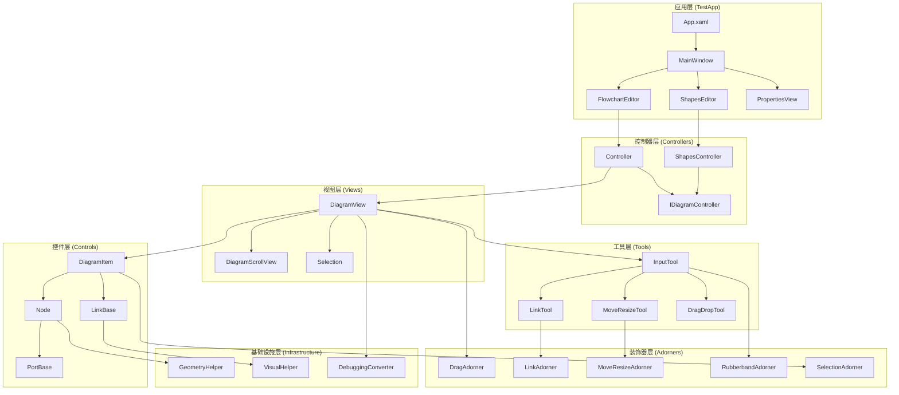
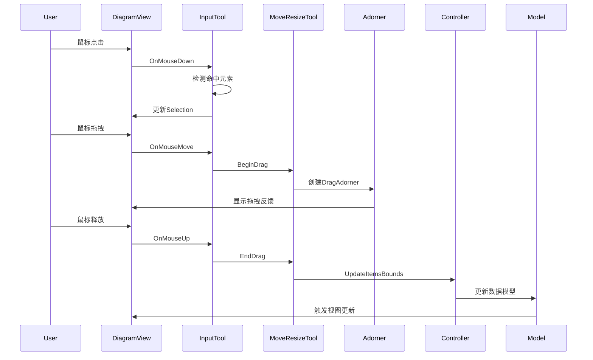
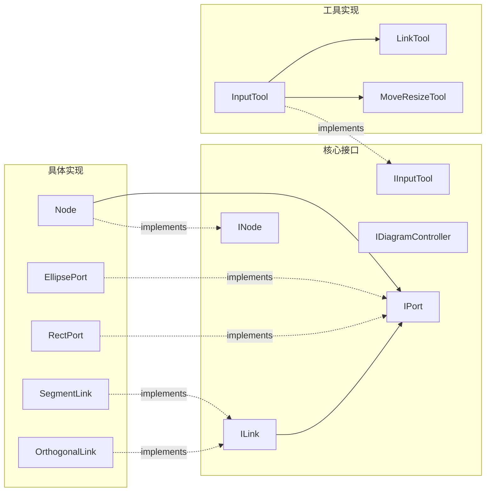
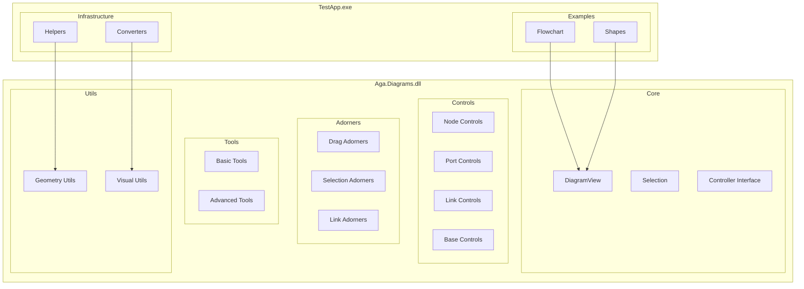
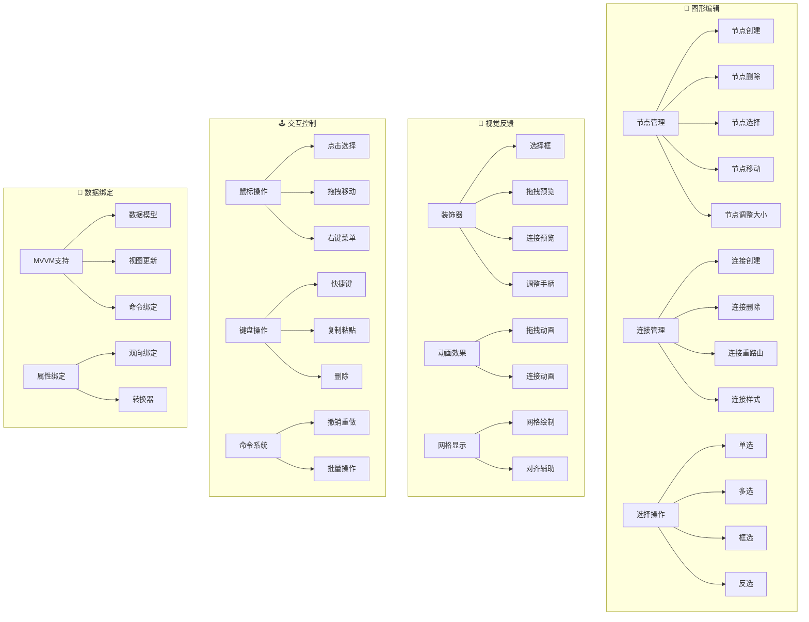
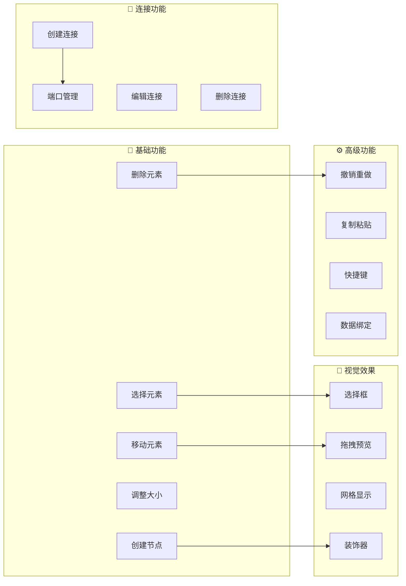
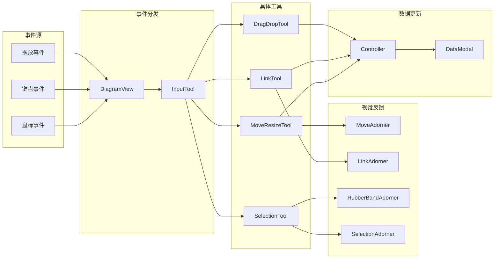
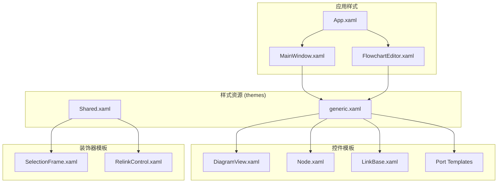
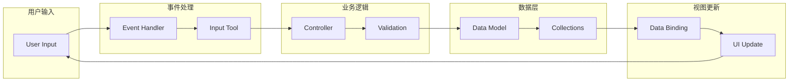

# WpfDiagram 系统架构图

## 🏗️ 整体架构图

## 🔄 交互流程图

## 🧩 组件依赖图

## 📦 模块组织图

## 🎯 功能模块图

## 🗺️ 功能概览图

## 🔧 工具链架构图

## 🎨 样式和模板架构

## 🔍 数据流图

这些架构图从不同角度展示了WpfDiagram项目的设计结构，帮助你更好地理解整个系统的组织方式和工作原理。

---

## 📝 图表说明

### Mermaid 语法要点
- 所有节点文本都用双引号包裹，避免特殊字符问题
- 子图（subgraph）名称用双引号包裹，支持中文显示
- 使用合适的图表类型：
  - `graph TB/LR`: 基础流程图
  - `flowchart LR`: 现代流程图
  - `sequenceDiagram`: 时序图

### 查看建议
- 建议使用支持 Mermaid 的 Markdown 编辑器查看（如 Typora、VS Code）
- 在线查看：[Mermaid Live Editor](https://mermaid.live/)
- 如果图表不显示，请检查 Markdown 预览器是否支持 Mermaid 语法

### 学习价值
这些架构图特别适合学习 C# 和 WPF 开发，展示了：
- **设计模式的实际应用**：策略模式、装饰器模式、观察者模式等
- **WPF 架构最佳实践**：MVVM、数据绑定、控件开发
- **大型项目的组织结构**：分层架构、模块化设计
- **交互系统的设计思路**：事件处理、工具链、视觉反馈