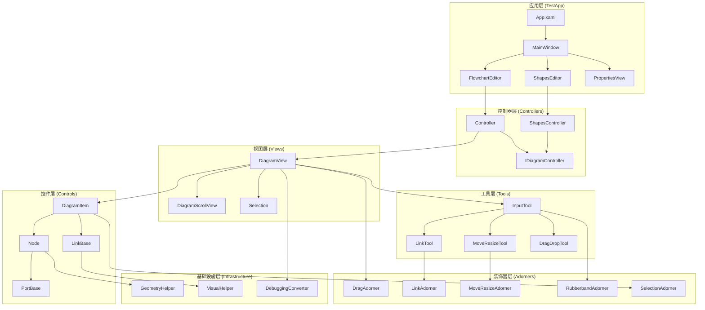
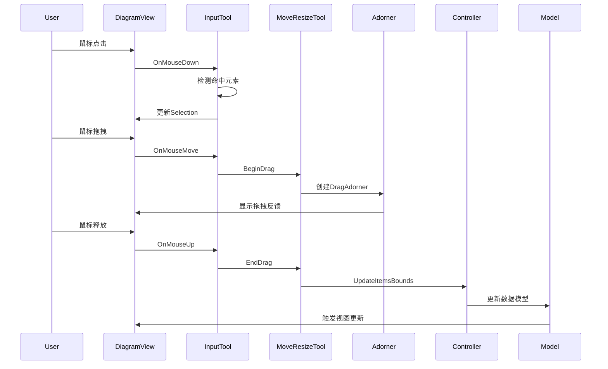
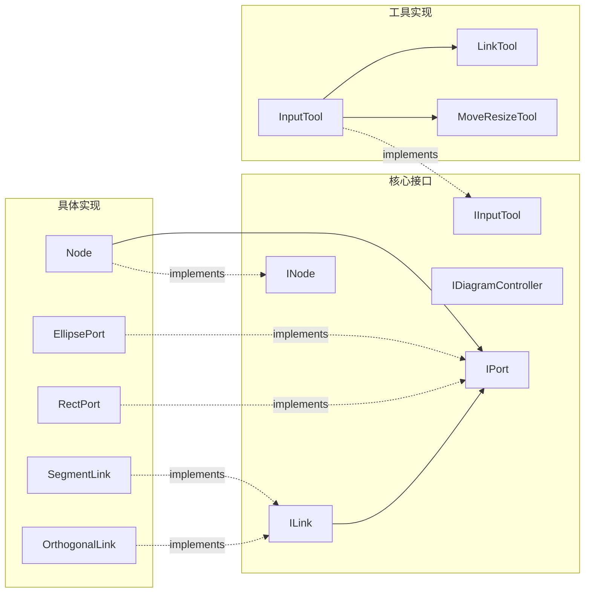
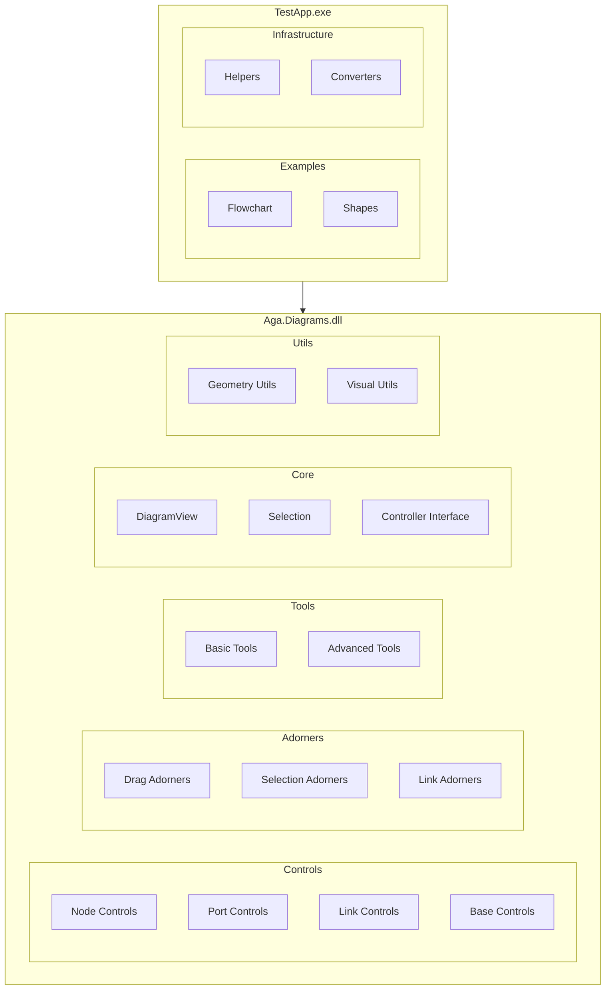
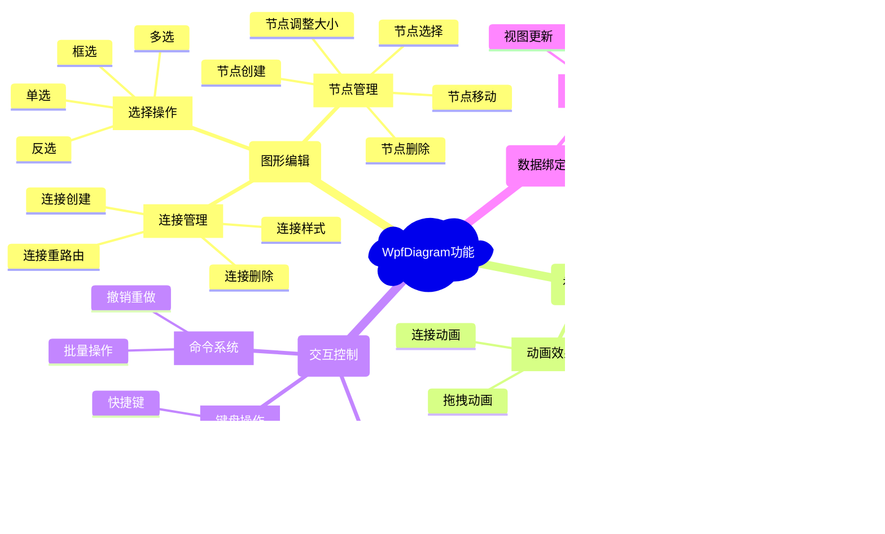
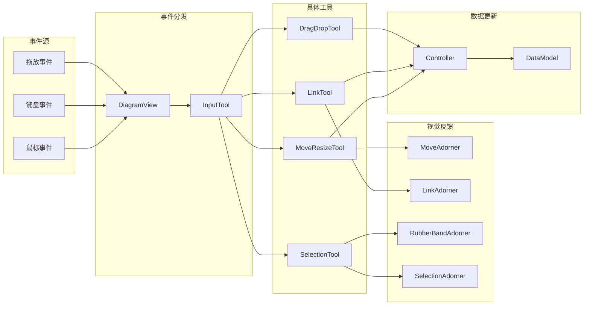
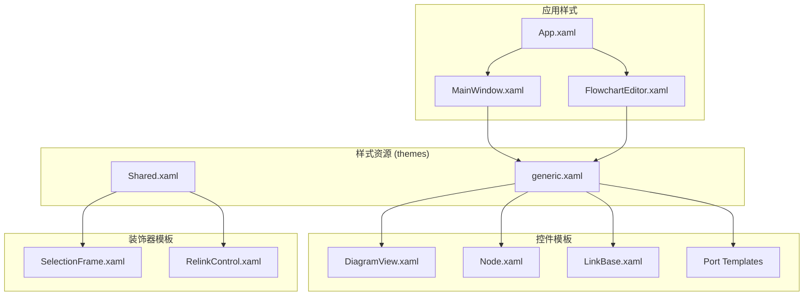
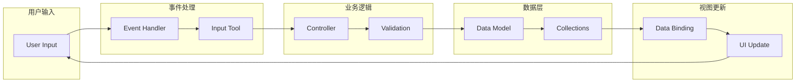

# WpfDiagram 系统架构图

## 🏗️ 整体架构图

```mermaid
graph TB
    subgraph "应用层 (TestApp)"
        APP[App.xaml]
        MAIN[MainWindow]
        FLOW[FlowchartEditor]
        SHAPE[ShapesEditor]
        PROP[PropertiesView]
    end
    
    subgraph "控制器层 (Controllers)"
        CTRL[Controller]
        SCTRL[ShapesController]
        ICTRL[IDiagramController]
    end
    
    subgraph "视图层 (Views)"
        DV[DiagramView]
        DSV[DiagramScrollView]
        SEL[Selection]
    end
    
    subgraph "工具层 (Tools)"
        IT[InputTool]
        MRT[MoveResizeTool]
        LT[LinkTool]
        DDT[DragDropTool]
    end
    
    subgraph "装饰器层 (Adorners)"
        DA[DragAdorner]
        LA[LinkAdorner]
        MRA[MoveResizeAdorner]
        RA[RubberbandAdorner]
        SA[SelectionAdorner]
    end
    
    subgraph "控件层 (Controls)"
        DI[DiagramItem]
        NODE[Node]
        LINK[LinkBase]
        PORT[PortBase]
    end
    
    subgraph "基础设施层 (Infrastructure)"
        GH[GeometryHelper]
        VH[VisualHelper]
        DC[DebuggingConverter]
    end
    
    APP --> MAIN
    MAIN --> FLOW
    MAIN --> SHAPE
    MAIN --> PROP
    
    FLOW --> CTRL
    SHAPE --> SCTRL
    CTRL --> ICTRL
    SCTRL --> ICTRL
    
    CTRL --> DV
    DV --> DSV
    DV --> SEL
    
    DV --> IT
    IT --> MRT
    IT --> LT
    IT --> DDT
    
    MRT --> MRA
    LT --> LA
    IT --> RA
    DI --> SA
    DV --> DA
    
    DV --> DI
    DI --> NODE
    DI --> LINK
    NODE --> PORT
    
    NODE --> GH
    LINK --> VH
    DV --> DC
```

## 🔄 交互流程图

```mermaid
sequenceDiagram
    participant U as User
    participant DV as DiagramView
    participant IT as InputTool
    participant MT as MoveResizeTool
    participant A as Adorner
    participant C as Controller
    participant M as Model
    
    U->>DV: 鼠标点击
    DV->>IT: OnMouseDown
    IT->>IT: 检测命中元素
    IT->>DV: 更新Selection
    
    U->>DV: 鼠标拖拽
    DV->>IT: OnMouseMove
    IT->>MT: BeginDrag
    MT->>A: 创建DragAdorner
    A->>DV: 显示拖拽反馈
    
    U->>DV: 鼠标释放
    DV->>IT: OnMouseUp
    IT->>MT: EndDrag
    MT->>C: UpdateItemsBounds
    C->>M: 更新数据模型
    M->>DV: 触发视图更新
```

## 🧩 组件依赖图

```mermaid
graph LR
    subgraph "核心接口"
        IN[INode]
        IP[IPort]
        IL[ILink]
        IDC[IDiagramController]
        IIT[IInputTool]
    end
    
    subgraph "具体实现"
        N[Node]
        EP[EllipsePort]
        RP[RectPort]
        SL[SegmentLink]
        OL[OrthogonalLink]
    end
    
    subgraph "工具实现"
        IT[InputTool]
        MRT[MoveResizeTool]
        LT[LinkTool]
    end
    
    N -.implements.-> IN
    EP -.implements.-> IP
    RP -.implements.-> IP
    SL -.implements.-> IL
    OL -.implements.-> IL
    
    IT -.implements.-> IIT
    
    N --> IP
    IL --> IP
    
    IT --> MRT
    IT --> LT
```

## 📦 模块组织图

```mermaid
graph TB
    subgraph "Aga.Diagrams.dll"
        subgraph "Controls"
            NC[Node Controls]
            PC[Port Controls]
            LC[Link Controls]
            BC[Base Controls]
        end
        
        subgraph "Adorners"
            DA[Drag Adorners]
            SA[Selection Adorners]
            LA[Link Adorners]
        end
        
        subgraph "Tools"
            BT[Basic Tools]
            AT[Advanced Tools]
        end
        
        subgraph "Core"
            DV[DiagramView]
            SEL[Selection]
            CTRL[Controller Interface]
        end
        
        subgraph "Utils"
            GEO[Geometry Utils]
            VIS[Visual Utils]
        end
    end
    
    subgraph "TestApp.exe"
        subgraph "Examples"
            FC[Flowchart]
            SH[Shapes]
        end
        
        subgraph "Infrastructure"
            HELP[Helpers]
            CONV[Converters]
        end
    end
    
    TestApp.exe --> Aga.Diagrams.dll
```

## 🎯 功能模块图

```mermaid
mindmap
  root)WpfDiagram功能(
    (图形编辑)
      [节点管理]
        节点创建
        节点删除
        节点选择
        节点移动
        节点调整大小
      [连接管理]
        连接创建
        连接删除
        连接重路由
        连接样式
      [选择操作]
        单选
        多选
        框选
        反选
    (视觉反馈)
      [装饰器]
        选择框
        拖拽预览
        连接预览
        调整手柄
      [动画效果]
        拖拽动画
        连接动画
      [网格显示]
        网格绘制
        对齐辅助
    (交互控制)
      [鼠标操作]
        点击选择
        拖拽移动
        右键菜单
      [键盘操作]
        快捷键
        复制粘贴
        删除
      [命令系统]
        撤销重做
        批量操作
    (数据绑定)
      [MVVM支持]
        数据模型
        视图更新
        命令绑定
      [属性绑定]
        双向绑定
        转换器
```

## 🔧 工具链架构图

```mermaid
graph LR
    subgraph "事件源"
        MOUSE[鼠标事件]
        KEY[键盘事件]
        DRAG[拖放事件]
    end
    
    subgraph "事件分发"
        DV[DiagramView]
        IT[InputTool]
    end
    
    subgraph "具体工具"
        MT[MoveResizeTool]
        LT[LinkTool]
        DT[DragDropTool]
        ST[SelectionTool]
    end
    
    subgraph "视觉反馈"
        MA[MoveAdorner]
        LA[LinkAdorner]
        RA[RubberBandAdorner]
        SA[SelectionAdorner]
    end
    
    subgraph "数据更新"
        CTRL[Controller]
        MODEL[DataModel]
    end
    
    MOUSE --> DV
    KEY --> DV
    DRAG --> DV
    
    DV --> IT
    
    IT --> MT
    IT --> LT
    IT --> DT
    IT --> ST
    
    MT --> MA
    LT --> LA
    ST --> RA
    ST --> SA
    
    MT --> CTRL
    LT --> CTRL
    DT --> CTRL
    
    CTRL --> MODEL
```

## 🎨 样式和模板架构

```mermaid
graph TB
    subgraph "样式资源 (themes)"
        GENERIC[generic.xaml]
        SHARED[Shared.xaml]
    end
    
    subgraph "控件模板"
        DT[DiagramView.xaml]
        NT[Node.xaml]
        LT[LinkBase.xaml]
        PT[Port Templates]
    end
    
    subgraph "装饰器模板"
        SF[SelectionFrame.xaml]
        RC[RelinkControl.xaml]
    end
    
    subgraph "应用样式"
        APP[App.xaml]
        MAIN[MainWindow.xaml]
        FLOW[FlowchartEditor.xaml]
    end
    
    GENERIC --> DT
    GENERIC --> NT
    GENERIC --> LT
    GENERIC --> PT
    
    SHARED --> SF
    SHARED --> RC
    
    APP --> MAIN
    APP --> FLOW
    
    MAIN --> GENERIC
    FLOW --> GENERIC
```

## 🔍 数据流图

```mermaid
graph LR
    subgraph "用户输入"
        UI[User Input]
    end
    
    subgraph "事件处理"
        EH[Event Handler]
        IT[Input Tool]
    end
    
    subgraph "业务逻辑"
        CTRL[Controller]
        VAL[Validation]
    end
    
    subgraph "数据层"
        MODEL[Data Model]
        COLL[Collections]
    end
    
    subgraph "视图更新"
        BIND[Data Binding]
        UI_UPDATE[UI Update]
    end
    
    UI --> EH
    EH --> IT
    IT --> CTRL
    CTRL --> VAL
    VAL --> MODEL
    MODEL --> COLL
    COLL --> BIND
    BIND --> UI_UPDATE
    UI_UPDATE --> UI
```

这些架构图从不同角度展示了WpfDiagram项目的设计结构，帮助你更好地理解整个系统的组织方式和工作原理。