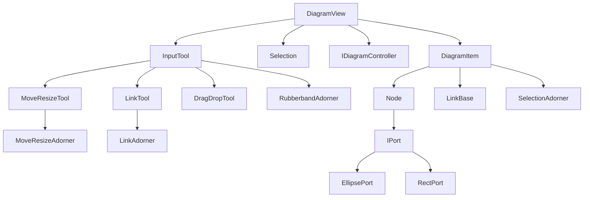

# WpfDiagram 项目架构分析

## 📋 项目概述

**WpfDiagram** 是一个基于WPF（Windows Presentation Foundation）的图形化拖拽控件库，用于实现可交互的图表编辑功能，如流程图、拓扑图等。该项目采用模块化设计，支持节点创建、连接、拖拽、选择等丰富的图形编辑操作。

### 🎯 主要功能
- ✨ 图形元素的拖拽与放置
- 🔗 节点之间的连接与连线重绘
- 📦 橡皮筋选择（多选）
- ↕️ 元素的移动与缩放
- 🛠️ 可自定义的工具链（拖拽工具、连接工具）
- 🎨 基于WPF Adorner机制的视觉反馈

### 🔧 技术特性
- **架构模式**: MVVM友好设计，分层架构
- **核心技术**: WPF Adorner、数据绑定、命令模式
- **设计模式**: 接口隔离、策略模式、装饰器模式
- **扩展性**: 模块化设计，支持自定义节点、端口和连接方式

---

## 🏗️ 系统架构

### 整体架构层次
```
┌─────────────────────────────────────────────┐
│                应用层 (TestApp)              │
├─────────────────────────────────────────────┤
│              控制器层 (Controllers)          │
├─────────────────────────────────────────────┤
│              视图层 (DiagramView)            │
├─────────────────────────────────────────────┤
│            工具层 (Tools & Adorners)         │
├─────────────────────────────────────────────┤
│           控件层 (Controls & Ports)          │
├─────────────────────────────────────────────┤
│            基础设施层 (Util & Base)          │
└─────────────────────────────────────────────┘
```

### 核心组件交互图


---

## 📁 项目结构详解

### 🔹 Aga.Diagrams (核心库)

#### 📂 Adorners (装饰器层)
视觉反馈和交互装饰器，提供拖拽、选择、连接时的动态效果。

| 文件 | 功能描述 |
|------|----------|
| `DragAdorner.cs` | 拖拽时的视觉反馈装饰器 |
| `LinkAdorner.cs` | 连接线创建时的预览装饰器 |
| `MoveResizeAdorner.cs` | 移动和调整大小的装饰器 |
| `RubberbandAdorner.cs` | 橡皮筋选择框装饰器 |
| `SelectionAdorner.cs` | 元素选中状态的装饰器 |

#### 📂 Controls (控件层)
基础UI控件，包含节点、端口、链接等图形元素。

**🔸 Node (节点相关)**
| 文件 | 功能描述 |
|------|----------|
| `INode.cs` | 节点接口定义 |
| `Node.cs` | 节点控件实现，支持内容显示和端口管理 |

**🔸 Ports (端口相关)**
| 文件 | 功能描述 |
|------|----------|
| `IPort.cs` | 端口接口定义 |
| `PortBase.cs` | 端口基类，定义连接点基础功能 |
| `EllipsePort.cs` | 圆形端口实现 |
| `RectPort.cs` | 矩形端口实现 |

**🔸 Links (连接线相关)**
| 文件 | 功能描述 |
|------|----------|
| `ILink.cs` | 连接线接口定义 |
| `LinkBase.cs` | 连接线基类 |
| `SegmentLink.cs` | 分段连接线实现 |
| `LinkThumb.cs` | 连接线控制点 |
| `LinkThumbKind.cs` | 连接线控制点类型枚举 |
| `RelinkControl.cs` | 重新连接控制器 |

**🔸 基础控件**
| 文件 | 功能描述 |
|------|----------|
| `DiagramItem.cs` | 图表元素基类，提供选择状态管理 |
| `DragThumb.cs` | 拖拽控制点 |
| `DragThumbKinds.cs` | 拖拽控制点类型枚举 |
| `SelectionFrame.cs` | 选择框架 |

#### 📂 Tools (工具层)
输入处理和交互工具，实现不同的操作模式。

| 文件 | 功能描述 |
|------|----------|
| `IInputTool.cs` | 输入工具接口 |
| `InputTool.cs` | 基础输入处理工具，处理选择和拖拽启动 |
| `IMoveResizeTool.cs` | 移动调整工具接口 |
| `MoveResizeTool.cs` | 移动和调整大小工具实现 |
| `ILinkTool.cs` | 连接工具接口 |
| `LinkTool.cs` | 连接线创建工具 |
| `IDragDropTool.cs` | 拖放工具接口 |

#### 📂 Util (工具类)
几何计算和视觉树操作的辅助类。

| 文件 | 功能描述 |
|------|----------|
| `GeometryHelper.cs` | 几何计算辅助类 |
| `VisualHelper.cs` | 视觉树遍历辅助类 |
| `DebuggingConverter.cs` | 调试用数据转换器 |

#### 🔹 核心文件
| 文件 | 功能描述 |
|------|----------|
| `DiagramView.cs` | **核心画布控件**，继承Canvas，提供网格、缩放、事件处理 |
| `DiagramScrollView.cs` | 带滚动功能的图表视图 |
| `IDiagramController.cs` | **控制器接口**，定义数据更新操作 |
| `Selection.cs` | **选择管理器**，处理元素选中状态 |
| `LinkInfo.cs` | 连接信息数据结构 |

### 🔹 TestApp (示例应用)

#### 📂 Flowchart (流程图示例)
完整的流程图编辑器实现，展示MVVM模式应用。

**🔸 Model (数据模型)**
| 文件 | 功能描述 |
|------|----------|
| `FlowchartModel.cs` | 流程图数据模型 |
| `FlowNode.cs` | 流程节点数据模型 |
| `Link.cs` | 连接线数据模型 |

**🔸 Controller & Tools**
| 文件 | 功能描述 |
|------|----------|
| `Controller.cs` | **流程图控制器**，实现IDiagramController |
| `CustomLinkTool.cs` | 自定义连接工具 |
| `CustomMoveResizeTool.cs` | 自定义移动调整工具 |
| `DragDropTool.cs` | 拖放工具实现 |
| `OrthogonalLink.cs` | 正交连接线实现 |
| `FlowchartEditor.xaml.cs` | 流程图编辑器视图 |

#### 📂 ShapesExample (图形示例)
基础图形操作的简单示例。

| 文件 | 功能描述 |
|------|----------|
| `Shapes.cs` | 基础图形定义 |
| `ShapesController.cs` | 图形控制器 |
| `ShapesEditor.xaml.cs` | 图形编辑器视图 |

#### 🔹 应用入口
| 文件 | 功能描述 |
|------|----------|
| `App.xaml.cs` | 应用程序入口 |
| `MainWindow.xaml.cs` | 主窗口类 |
| `PropertiesView.xaml.cs` | 属性视图 |
| `CollectionHelper.cs` | 集合操作辅助类 |
| `ItemsControlDragHelper.cs` | 拖拽辅助类 |

### 🔹 样式和模板 (themes目录)

| 文件 | 功能描述 |
|------|----------|
| `generic.xaml` | 通用样式定义 |
| `DiagramView.xaml` | DiagramView控件模板 |
| `Node.xaml` | Node控件模板 |
| `LinkBase.xaml` | 连接线样式模板 |
| `EllipsePort.xaml` | 圆形端口样式 |
| `RectPort.xaml` | 矩形端口样式 |
| `SelectionFrame.xaml` | 选择框样式 |
| `RelinkControl.xaml` | 重连控制器样式 |
| `Shared.xaml` | 共享资源定义 |

---

## 🔄 核心工作流程

### 1. 初始化流程
```
DiagramView创建 → 注册工具 → 绑定控制器 → 设置样式
```

### 2. 用户交互流程
```
鼠标事件 → InputTool分发 → 具体工具处理 → Adorner反馈 → 控制器更新数据
```

### 3. 元素管理流程
```
数据模型变更 → 控制器监听 → 视图更新 → 重新布局 → UI刷新
```

---

## 🎨 设计模式应用

### 1. **策略模式 (Strategy Pattern)**
- `IInputTool`、`IMoveResizeTool`、`ILinkTool` 等接口
- 不同工具实现不同的交互策略

### 2. **装饰器模式 (Decorator Pattern)**
- `Adorner` 系统为元素添加运行时视觉装饰
- 不修改原始控件，动态添加功能

### 3. **接口隔离 (Interface Segregation)**
- `INode`、`IPort`、`ILink` 等接口分离职责
- 降低耦合，提高可扩展性

### 4. **命令模式 (Command Pattern)**
- WPF命令系统集成
- 支持撤销/重做操作

### 5. **观察者模式 (Observer Pattern)**
- 基于WPF数据绑定和事件机制
- 自动UI更新和状态同步

---

## 🚀 快速开始

### 环境要求
- Visual Studio 2019+
- .NET Framework 4.0+
- WPF支持

### 编译运行
1. 克隆项目到本地
2. 使用Visual Studio打开解决方案
3. 编译Aga.Diagrams类库
4. 运行TestApp查看示例

### 基础使用
```csharp
// 创建图表视图
var diagramView = new DiagramView();

// 设置控制器
diagramView.Controller = new MyController();

// 添加到容器
container.Children.Add(diagramView);
```

---

## 📝 学习建议

作为C#和WPF学习者，建议按以下顺序学习：

1. **基础概念**: 先理解DiagramView、DiagramItem、Selection等核心类
2. **工具系统**: 学习InputTool如何处理用户交互
3. **Adorner机制**: 理解WPF装饰器如何提供视觉反馈
4. **MVVM应用**: 研究Flowchart示例的MVVM实现
5. **自定义扩展**: 尝试创建自定义节点和工具

通过这个项目，你可以深入学习WPF的高级特性，包括自定义控件、数据绑定、命令模式、装饰器等重要概念。

---

## ⚠️ 注意事项

- 项目源自网络，版权归原作者所有
- 建议在学习和参考基础上进行二次开发
- 大量节点时注意Adorner性能优化
- 缺少单元测试，修改时需谨慎